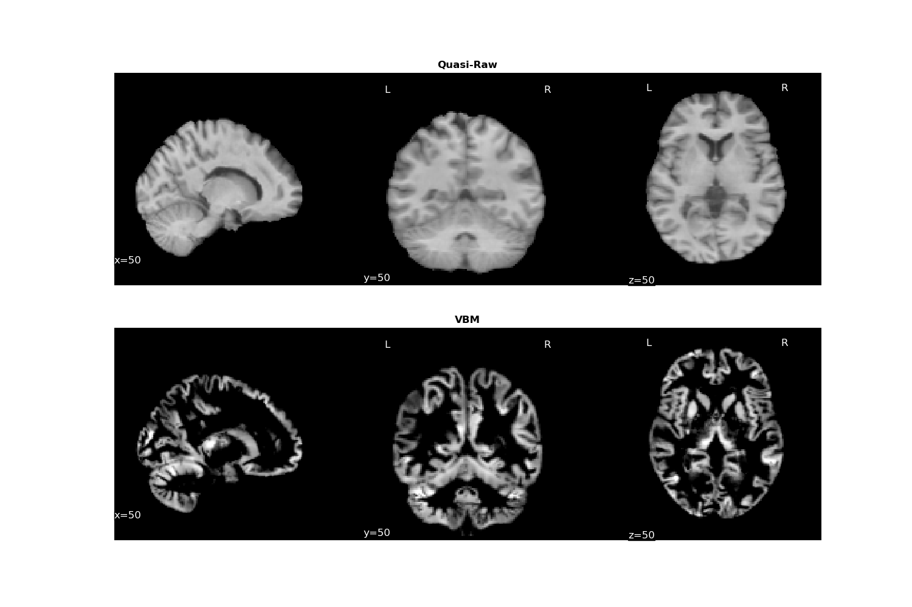
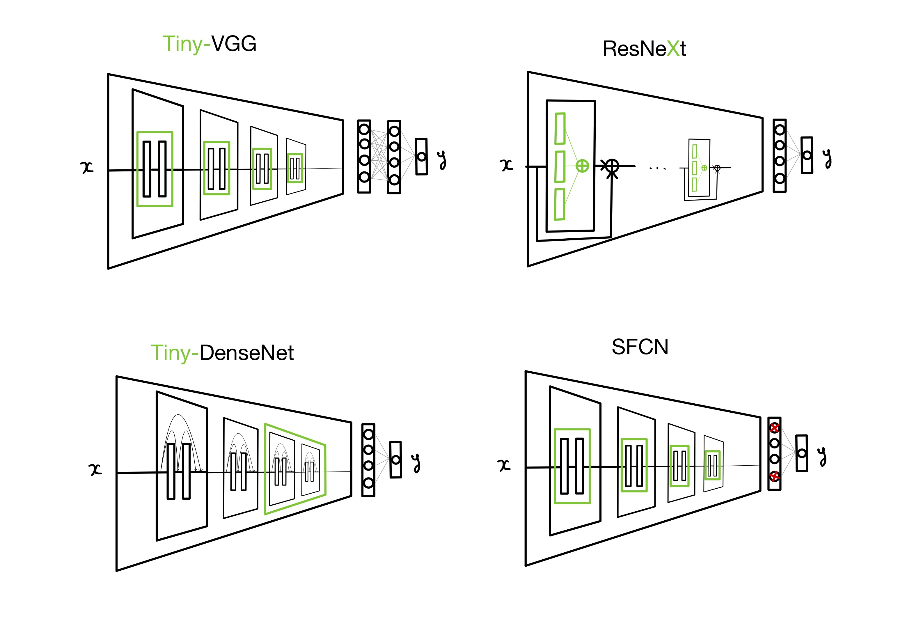
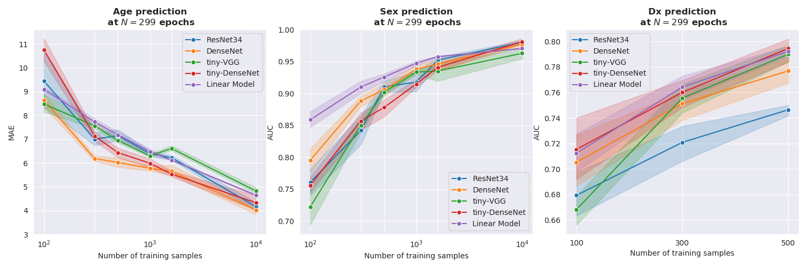
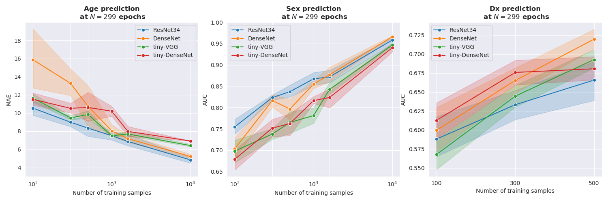

## Abstract

## Data 
### Pre-processings

**Quasi-Raw**. It consists essentially in brain extraction with [BET2](http://poc.vl-e.nl/distribution/manual/fsl-3.2/bet2) 
and a linear registration to the MNI template with [FLIRT](https://fsl.fmrib.ox.ac.uk/fsl/fslwiki/FLIRT) for a final 
isotropic spatial resolution of 1.5mm.\
\
**Voxel-Based Morphometry (VBM)**. This is an extensive pre-processing performed with [CAT12](http://www.neuro.uni-jena.de/cat/). 
The brain is segmented into 3 tissues: Gray Matter (GM), White Matter (WM) and Cerebrospinal Fluid (CSF) and it is then re-aligned 
non-linearly to the MNI template with [DARTEL](https://pubmed.ncbi.nlm.nih.gov/17761438) resampled at 1.5mm isotropic.
 We used only the T1-weighted modulated GM modality.  

### BHB-10K Dataset 

We aggregated 13 brain MRI datasets of healthy controls (HC) both pre-processed with VBM and Quasi-Raw.

**Source**  | **# Subjects**  | **# Sessions** | **Age** | **Sex (\%F)** | **# Sites**
:---: | :---: | :---: | :---: | :---: | :---: | 
[HCP](https://www.humanconnectome.org/study/hcp-young-adult)  | 1113 | 1113 | 29 ± 4 | 45 | 1
[IXI](http://brain-development.org/ixi-dataset) | 559 | 559 | 48 ± 16 | 55 | 3 
[CoRR](https://www.nitrc.org/projects/fcon_1000) | 1371 | 2897 | 26 ± 16 | 50 | 19
[NPC](https://openneuro.org/datasets/ds002330/versions/1.1.0) | 65 | 65 | 26 ± 4 | 55 | 1
[NAR](https://openneuro.org/datasets/ds002345/versions/1.0.1) | 303 | 323 | 22 ± 5 | 58 | 1
[RBP](https://openneuro.org/datasets/ds002247/versions/1.0.0) | 40 | 40 | 23 ± 5 | 52 | 1
[OASIS 3](https://www.oasis-brains.org) | 597 | 1262 | 67 ± 9 | 62 | 3
[GSP](https://dataverse.harvard.edu/dataset.xhtml?persistentId=doi:10.7910/DVN/25833) | 1570 | 1639 | 21 ± 3 | 58 | 1
[ICBM](https://ida.loni.usc.edu) | 622 | 977 | 30 ± 12 | 45 | 3
[ABIDE 1](http://fcon_1000.projects.nitrc.org/indi/abide) | 567 | 567 | 17 ± 8 | 17 | 20
[ABIDE 2](http://fcon_1000.projects.nitrc.org/indi/abide) | 559 | 580 | 15 ± 9 | 30 | 17
[Localizer](http://brainomics.cea.fr/localizer/localizer) | 82 | 82 | 25 ± 7 | 56 | 2
[MPI-Leipzig](https://openneuro.org/datasets/ds000221/versions/00002) | 316 | 316 | 37 ± 19 | 40 | 2
**Total** | 7764 | **10420** | 32 ± 19 | 50 | 74 

### Clinical Datasets

We focused our analysis only on HC and Schizophrenia for the clinical datasets.

**Source**  | **# Subjects** | **Diagnosis** | **Age** | **Sex (\%F)** | **# Sites**
:---: | :---: | :---: | :---: | :---: | :---: | 
[BSNIP](https://academic.oup.com/schizophreniabulletin/article/40/Suppl_2/S131/1933599)  | 394 | Schizophrenia Control | 34 ± 12 38 ± 13  | 44 58  | 5 
[SCHIZCONNECT-VIP](http://schizconnect.org) | 605 | Schizophrenia Control | 34 ± 12 32 ± 12  | 27 47  | 4 
*More to come* |

### Links to the Pre-Processed Datasets

**Dataset** | **Pre-Processing** | **# Images** | **Target**|  **Link** 
|:---:|:---:|:---:|:---:|:---:|
BHB-10K |  Quasi-Raw | ?  | Age + Sex | ? |
BHB-10K | VBM | ? | Age + Sex | ? | 
SCHIZCONNECT-VIP | Quasi-Raw | ? | SCZ vs CTL | ? |
SCHIZCONNECT-VIP | VBM | ? | SCZ vs CTL | ? |
*BSNIP (Test Set)* | Quasi-Raw | ? | SCZ vs CTL Age+Sex | ? |
*BSNIP (Test Set)* | VBM | ? | SCZ vs CTL Age+Sex | ? |

  
## CNN Models

## Training/Test Split

We aim at giving results in the real clinical setting where the model is evaluated on new data arriving from
different hospitals (different acquisition protocols). 

Task | Training Set | Test Set | 
|:---: | :---: | :---: |
Age | BHB-10K | BSNIP (**only HC**)
Sex | BHB-10K | BSNIP (**only HC**)
SCZ vs HC | SCHIZCONNECT-VIP | BSNIP 

## Main Results
### Learning curves
#### 1) VBM

#### 2) Quasi-Raw

**Note:**  linear models give results no better than chance with quasi-raw data.

### Best Final Results

We reported the results for 3 (resp. 5) runs on 3 (resp. 5) Stratified Shuffle Splits at N=10K (resp. N=500).
We stratified according to the label to predict. The hyperparameters for the linear models are tuned using grid search. 

#### Linear Model Baseline

**Task** | **Model** | **# Training Samples**| **Pre-Processing** | **AUC**(%) | **MAE**
|:---: | :---: |:---: | :---: | :---: | :---: |
Age | Ridge | 10K |  VBM | N/A | 4.65±0.02 
Sex | Logistic | 10K | VBM  | 97.05±0.03   | N/A
SCZ vs HC | Logistic | 500 | VBM | 78.71±0.76 | N/A

 

#### CNN Models

The models are trained for 300 epochs at N=10K and for 100 epochs at N=500. We use Deep Ensemble with T=5
CNN to have accurate and better calibrated models. We give the weights of our final 
models and you can find [our code on Github](). 

**Task** | **Model** | **# Training Samples**|  **Deep Ensemble (x5)** | **Pre-Processing** | **AUC** | **MAE**|**Weights**
|:---: | :---: | :---: | :---: | :---: | :---: | :---: | :---: |
Age | DenseNet121 | 10K |  ❌ |  VBM | N/A | **4.03±0.13** | [download]()
Age | ResNet34 | 10K |  ❌ |  Quasi-Raw | N/A | 4.84±0.26 | [download]()
Sex | DenseNet121 | 10K |  ❌️ | VBM | **97.69±0.21** | N/A | [download]()
Sex | DenseNet121 | 10K |  ❌️ | Quasi-Raw | 96.58±0.21 | N/A | [download]()
SCZ vs HC | tiny-DenseNet | 500 |  ✔️ | VBM | **80.92±0.47**| N/A | [download]()
SCZ vs HC | DenseNet121 |500 |  ✔️ | Quasi-Raw | ? | N/A | [download]()

